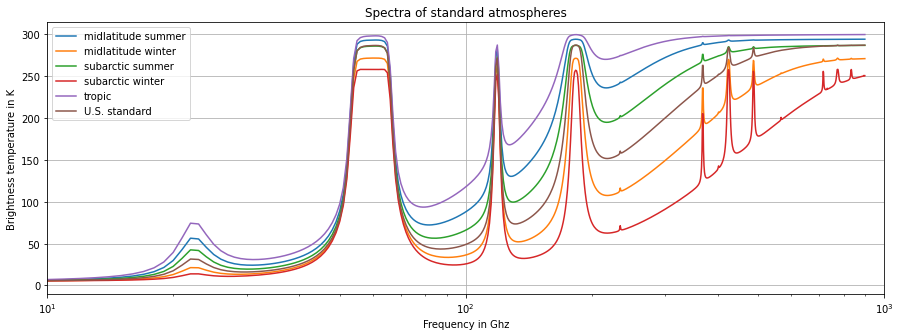

# Line-by-Line Microwave Radiative Transfer Model in python (lbl_rt_py)

A line-by-line non-scattering radiative transfer
model designed for simulating atmospheric 
transmission, emission, and absorption spectra.
Primary output are brightness temperatures (TB) for frequencies 
between 1 GHz and 900 GHz.

## 🌐 Overview

This tool calculates radiative transfer through
the atmosphere using spectrally resolved 
line-by-line methods, accounting for gas 
absorption, temperature profiles, 
and pressure-dependent line broadening. 
It is suitable for remote sensing, 
climate modeling, and atmospheric physics 
applications.

## ✨ Features

- Line-by-line spectral integration  
- Customizable atmospheric profiles (temperature, pressure,
  water vapor and liquid water content)  
- Multiple geometries (nadir, slant path)  
- Output in brightness temperature or radiation intensity  
- Extensible design and modular structure  

## 🚀 Installation

Clone the repository and install dependencies:

```bash
git clone https://github.com/moritzloeffler/lbl_rt_py.git
cd lbl_rt_py
pip install -r requirements.txt
```

## 📈 Usage

Run the model from the command line:

```bash
python lbl "config/examples/statm_r22_config.json"
```
or 
```bash
python lbl "examples"
```

Or import and use it in Python:

```python
import lbl
import basic_functions as functions

config_path = "config/standard_atmospheres_input.json"
config = functions.loadConfig(config_path)
lbl.rt_standard_atm("config/standard_atmospheres_input.json")
```

## 🧪 Example

Example plot of the simulated spectra:



## 📥 Inputs

The RT calculation is configured in the configuration .json file specified
in the prompt. The structure and the possible input can be found in 
`./config/examples/fill_config.json`.

- `"freqs"` can be `str` or `List[flaot]` and specifies the frequencies for which to
  perform the RT-calculation
- `"theta"` is the list of zenith angles which shall be computed.
- `"abs_mod"` specifies the oxygen and water vapor absorption models,
  possible models are
  - `"r98"` Rosenkranz 1998
  - `"r20"` Rosenkranz 2020
  - `"r22"` Rosenkranz 2022
- `"cloud_abs"` specifies the cloud liquid water absorption models,
  possible models are
  - `"lie"` Liebe, Hufford and Manabe, INT. J. IR & MM WAVES V.12, pp.659-675
    (1991);  Liebe et al, AGARD Conf. Proc. 542, May 1993.
  - `"ell"` Book article from William Ellison in Maetzler 2006 (p.431-455):
     Thermal Microwave Radiation: Applications for Remote Sensing IET Electromagnetic
    Waves Series 52 ISBN: 978-086341-573-9
  - `"ell07"` Ellison, W. J., J.Phys.Chem.Ref.Data, Vol. 36, No. 1, 2007
  
- `"linew_22"` air mass correction coefficients and/or model. The following combinations
  are possible
  - `"no"` flat earth and no refraction
  - `"sphere"` spherical earth and no refraction
  - `"43"` spherical earth with inflated radius by x 4/3 and no refraction
  - `rozenberg_66"`, `"young_94"` and `"pickering_02"` approximate the optical thickness 
    as a function of the zenith angle theta and do not consider refraction.
    
  - `"thayer_74"`, `"liebe_77"`, `"hill_80"`, `"bevis_94"`, `"rueeger_aver_02"` and `"rueeger_avai_02"` 
   calculate the optical path trough the atmosphere
   and consider a spherical earth and different refractive indexes
   according to RADIOWAVE PROPAGATION , Levis, pp.121.
  
- `"station_height"` is the height of the ground level in the atmosphere. 
  if `null` the ground level given in the model is used, otherwise the model 
  column is interpolated or extrapolated to insert an additional level.
- `"use_multiprocessing"` is `bool`. If `true` RT-calcuation is
  spread across the available CPUs.
- `"clear_sky_only"` is `bool`. If `true` `"LWC"` is set to zero.

`lbl_rt_py` is designed to run with default netCDF files from ERA5 on pressure and on 
model levels, ICON-D2 feedback, and the included standard atmospheres. Find examples for
the file formats included in `./data/examples/`. Note that the Icon-D2 files additionaly
require the grid definition included in the "height of half levels file" (hhl-file).


## 📤 Outputs

The model produces:

- NetCDF file with a grid of TB for the given:
  - times
  - frequencies and
  - elevation angles


## 📦 Dependencies

- `numpy`  
- `DateTime`  
- `xarray` 

All required packages are listed in `requirements.txt`.

## 📄 License

<a rel="license" href="http://creativecommons.org/licenses/by-sa/4.0/"></a><br />This work is licensed under a <a rel="license" href="http://creativecommons.org/licenses/by-sa/4.0/">Creative Commons Attribution-ShareAlike 4.0 International License</a>.

## 📚 Citation

If you use this model in your research, please cite:

```
Moritz Löffler et. al.. (2025). Line-by-Line Radiative Transfer Model in python (lbl_rt_py) [Software]. Zenodo. https://doi.org/10.5281/zenodo.XXXXXXX
```

[](https://doi.org/10.5281/zenodo.XXXXXXX)

## 🙏 Acknowledgments

This project builds on the radiative transfer formulation from
Simmer (1994) in "Satellitenfernerkundung hydrologischer Parameter der Atmosphäre mit Mikrowellen",
ISBN 3-86064-196-4 pages 82 ff.. 

Absorption coefficients for water vapor, oxygen
(o2_abs19.f) and nitrogen were taken from Rosenkranz, P.W.: 
Line-by-line microwave radiative transfer (non-scattering) [software] 
(version 2022/08/25), http://cetemps.aquila.infn.it/mwrnet/lblmrt_ns.html 
(last access: 19 August 2025) 

## 📬 Contact

For questions or suggestions, contact:

**Moritz Löffler**  
GitHub: [@moritzloeffler](https://github.com/moritzloeffler)
